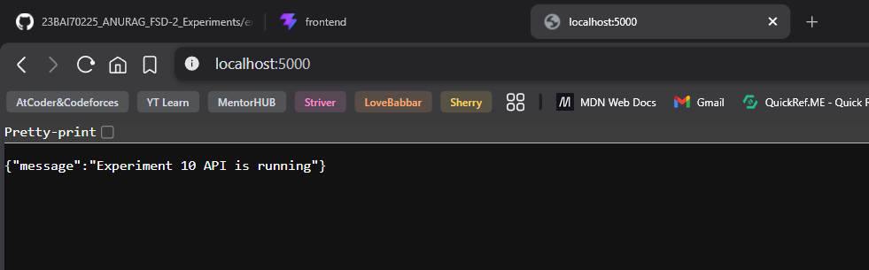

# Experiment 10 FSD (Frontend + Backend)

Full-stack CRUD project using React (Vite) for frontend and Node.js + Express + MongoDB for backend.

## Folder Structure

```text
exp-10-FSD/
|-- frontend/
|-- experiment10/
|   |-- server.js
|   |-- models/
|   |-- routes/
|   `-- screenshots/
`-- README.md
```

## Tech Stack

- Frontend: React, Vite, Axios
- Backend: Node.js, Express.js, Mongoose
- Database: MongoDB

## Run Frontend

```bash
cd frontend
npm install
npm run dev
```

Frontend URL: `http://localhost:5173`

## Run Backend

```bash
cd experiment10
npm install
npm run dev
```

Backend URL: `http://localhost:5000`

## API Base URL

`http://localhost:5000/api/students`

## Latest Screenshot


