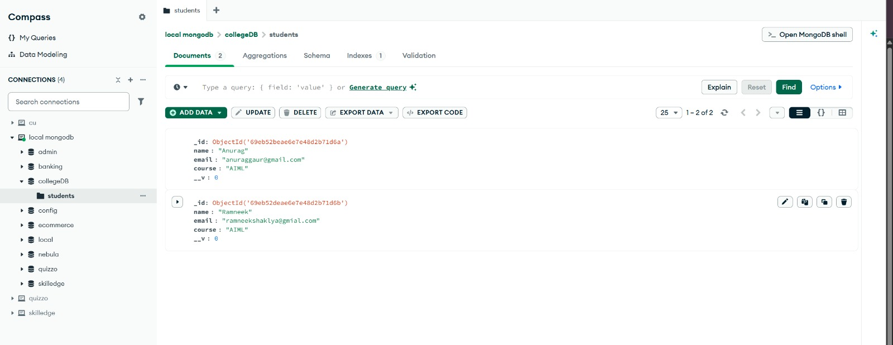
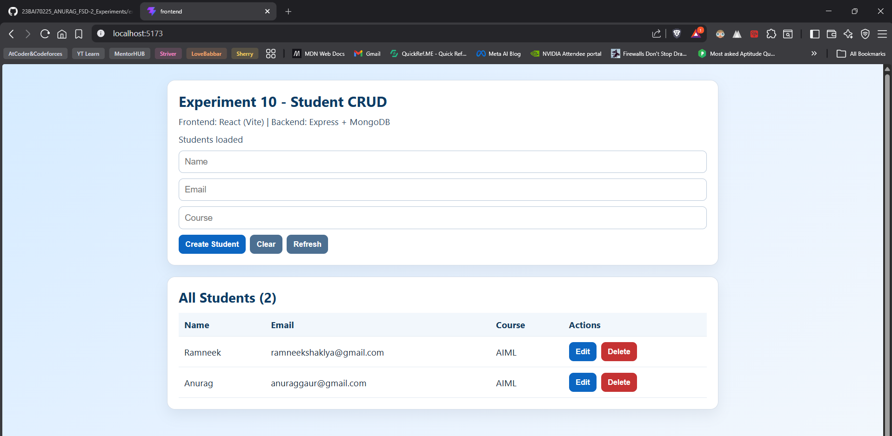
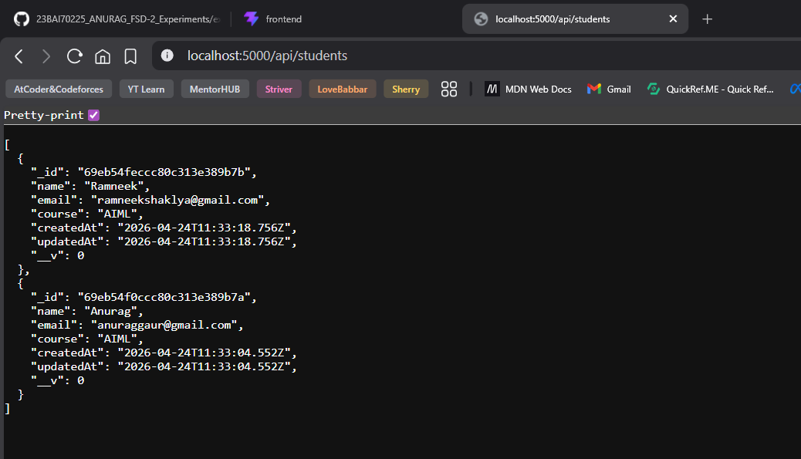

# Experiment 10
CRUD Operations on Database using Node.js + Express.js Backend

## Objective
- Build REST APIs using Node.js and Express.js
- Connect backend with MongoDB
- Perform Create, Read, Update, Delete operations
- Test APIs using Postman / Browser
- Understand backend routing and controllers

## Tech Stack
- Node.js
- Express.js
- MongoDB
- Mongoose
- Postman

## Project Structure
```text
experiment10/
|-- server.js
|-- models/
|   |-- Student.js
|-- routes/
|   `-- studentRoutes.js
|-- screenshots/
|-- package.json
`-- README.md
```

## Installation
```bash
npm install
```

## Run Backend
```bash
npm run dev
```

Server URL: `http://localhost:5000`

## API Endpoints
Base URL: `http://localhost:5000/api/students`

1. Create Record
- Method: `POST`
- URL: `/api/students`
- Body:
```json
{
  "name": "Rahul",
  "email": "rahul@gmail.com",
  "course": "BCA"
}
```

2. Get All Records
- Method: `GET`
- URL: `/api/students`

3. Get Single Record
- Method: `GET`
- URL: `/api/students/:id`

4. Update Record
- Method: `PUT`
- URL: `/api/students/:id`
- Body:
```json
{
  "course": "MCA"
}
```

5. Delete Record
- Method: `DELETE`
- URL: `/api/students/:id`

## Screenshots
### 1. MongoDB / Backend Output


### 2. API Test Output 1


### 3. API Test Output 2


### 4. API Test Output 3 (Latest)


## Notes for Submission
- Node.js and Express.js are used as backend
- MongoDB stores records
- CRUD operations are implemented using REST APIs
- APIs are tested using Postman / Browser
